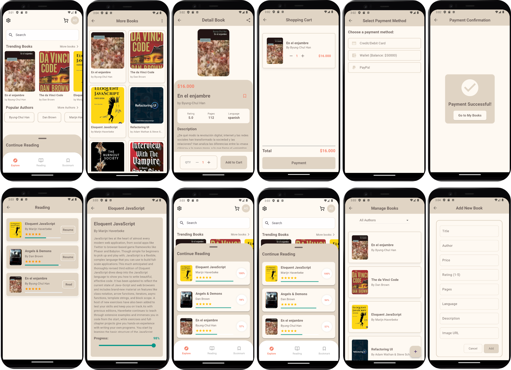

# E-Book Store App

Esta aplicación fue desarrollada como parte de una evaluación final en el marco de un programa de Desafío Latam, con una beca otorgada por Globant. El proyecto consiste en un e-commerce denominado E-Book Store, diseñado para permitir a los usuarios explorar un completo catálogo de libros electrónicos (eBooks) y realizar diversas acciones, como:

- Agregar libros al carrito de compras.
- Marcar libros como favoritos para un acceso rápido.
- Gestionar un mantenedor de libros, permitiendo crear, editar y eliminar títulos.

El desarrollo de la aplicación se llevó a cabo utilizando Flutter, con el patrón BLoC para el manejo eficiente de estados y Firebase como backend, asegurando un correcto funcionamiento de las operaciones CRUD y el almacenamiento de datos.

## Evaluación del Proyecto

Este proyecto es parte de una evaluación final para medir conocimientos en Flutter. Los criterios de evaluación incluyen:

- Implementación del patrón BLoC.
- Uso de Firebase para el backend (con Dio).
- Implementación del carrito de compras.
- Funcionalidades del mantenedor (crear, editar, eliminar libros).
- Gestión de favoritos y carga de imágenes.
- Creación de widgets personalizados.
- Diseño y experiencia de usuario (UX).

## Funcionalidades Principales

1. **Explorar Libros**: Ver una lista de libros con título, autor, precio e imagen de portada.
2. **Carrito de Compras**: Añadir libros al carrito y modificar las cantidades.
3. **Gestión de Libros**: Crear, editar y eliminar libros (modo administrador o mantenedor).
4. **Favoritos**: Marcar libros como favoritos para encontrarlos rápidamente.
5. **Gestión de Imágenes**: Cargar y mostrar imágenes de portada de los libros.
6. **Administración de datos**: Firebase como gestor del CRUD.

## Flujo de la Aplicación

- **Home**: Muestra la lista principal de libros y permite navegar a secciones como favoritos, carrito y mantenedor de libros.
- **Detalle del Libro**: Pantalla que muestra la información detallada de cada libro y permite añadirlo al carrito o marcarlo como favorito.
- **Carrito**: Permite gestionar los ítems seleccionados y proceder al pago.
- **Mantenedor de Libros**: Pantalla de administración para añadir, editar y eliminar libros.
- **Lectura**: Sección donde se listan los libros comprados y permite continuar con su lectura.

## Requisitos

Este proyecto fue desarrollado utilizando las siguientes herramientas y dependencias:

- **Entorno**:

  - Flutter SDK versión `^3.5.4`
  - Dart SDK compatible con la versión de Flutter especificada.

- **Dependencias principales**:
  - `flutter_bloc: ^8.1.6`: Para el manejo del estado utilizando el patrón BLoC.
  - `equatable: ^2.0.7`: Para comparar objetos de manera eficiente.
  - `dio: ^5.7.0`: Cliente HTTP utilizado para las operaciones CRUD.
  - `uuid: ^4.5.1`: Generación de identificadores únicos.
  - `flutter_svg_provider: ^1.0.7`: Para cargar y renderizar imágenes SVG.

## Estructura del Proyecto

```js
lib/
├── bloc/                   # Lógica de negocios y manejo de estados con BLoC
│   ├── cart_bloc.dart            # BLoC para manejar acciones del carrito de compras
│   ├── cart_event.dart           # Definición de eventos relacionados al carrito de compras
│   ├── cart_state.dart           # Definición de estados del carrito de compras
│   ├── e_book_bloc.dart          # BLoC para manejar acciones de los libros
│   ├── e_book_event.dart         # Definición de eventos relacionados a los libros
│   └── e_book_state.dart         # Definición de estados de los libros
│
├── models/                 # Modelos de datos utilizados en la aplicación
│   ├── cart_models.dart          # Modelo para ítems del carrito de compras
│   └── ebook_models.dart         # Modelo para representar libros electrónicos
│
├── payment/                # Pantallas relacionadas al proceso de pago
│   ├── payment_confirmation_screen.dart   # Pantalla de confirmación de pago
│   └── payment_method_screen.dart         # Pantalla para seleccionar método de pago
│
├── screen/                 # Pantallas principales de la aplicación
│   ├── add_book_screen.dart         # Pantalla para añadir nuevos libros
│   ├── authors_screen.dart          # Pantalla de autores disponibles
│   ├── book_detail_screen.dart      # Pantalla de detalles de un libro
│   ├── book_manager_screen.dart     # Pantalla para gestionar libros
│   ├── bookmark_screen.dart         # Pantalla de libros marcados como favoritos
│   ├── books_by_author_screen.dart  # Pantalla de libros filtrados por autor
│   ├── home_screen.dart             # Pantalla principal (Home)
│   ├── main_screen.dart             # Pantalla de navegación principal
│   ├── more_books_screen.dart       # Pantalla que muestra más libros
│   ├── reading_detail_screen.dart   # Pantalla de detalles de lectura
│   ├── reading_screen.dart          # Pantalla de libros en lectura
│   └── shopping_cart_screen.dart    # Pantalla del carrito de compras
│
├── widgets/                # Widgets reutilizables
│   ├── app_colors.dart             # Definición de colores utilizados
│   ├── app_primary_button.dart     # Widget personalizado para botones principales
│   ├── authors_carousel_widget.dart# Widget para carrusel de autores
│   ├── book_card_widget.dart       # Widget para tarjetas de libros
│   ├── book_form_widget.dart       # Widget para formulario de libros
│   ├── book_carousel.dart          # Widget para carrusel de libros
│   ├── continue_reading_widget.dart# Widget para continuar lectura
│   └── home_screen.dart            # Widget que construye la pantalla de inicio
│
└── main.dart                # Archivo principal que inicia la aplicación

```



**Configuración adicional**:

Si encuentras problemas al compilar el proyecto relacionados con Gradle o Java, es posible que debas especificar manualmente la versión de Gradle y la ubicación del JDK en el archivo `android/gradle.properties`.

En mi caso, añadí las siguientes líneas:

```properties
distributionUrl=https\://services.gradle.org/distributions/gradle-8.3-all.zip
org.gradle.java.home=C:\Program Files\Java\jdk-17 (acá cambiar por tu path)
```

- **distributionUrl**: Define la versión de Gradle que será utilizada durante la compilación del proyecto.
- **org.gradle.java.home**: Especifica la ruta donde tienes instalado el JDK 17.

## Cómo correr el proyecto

1. **Clonar el repositorio**:

   ```bash
   git clone https://github.com/vngerus/flutter_e-book_store.git
   cd flutter_ebook_store
   ```

2. **Instalar las dependencias**:
   Ejecuta el siguiente comando para instalar las dependencias declaradas en el archivo `pubspec.yaml`:
   ```bash
   flutter pub get
   ```
